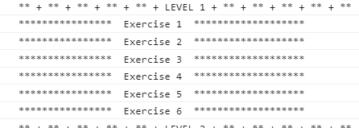

# ES6 Exercises

> Three levels of [IT Academy](https://itacademy.barcelonactiva.cat/) Exercise  using EcmaScript and the functions of Modern JavaScript.

## Live Demo

[Live Site](https://es6-exercises.netlify.app/)

### View:

 **Level 1**

 **Level 2**

 **Level 3**
 

## Built With

- HTML
- CSS ([Font Awesome](https://fontawesome.com/v4.7.0/))
- JavaScript

## Getting Started

Open index.html with your Browser.

## Author

👤 **Author**
- GitHub: [@Edi10-developer](https://github.com/Edi10-developer)
- LinkedIn: [LinkedIn](https://www.linkedin.com/in/edi-selimi-856671173/?locale=en_US)
- Portfolio: [www.ediselimi.com](https://ediselimi.com/)

## Show your support

Contributions, issues, and feature requests are welcome!
Give a ⭐️ if you like this project!

## Acknowledgments

- Hat tip to anyone whose code was used
- Inspiration
- etc

